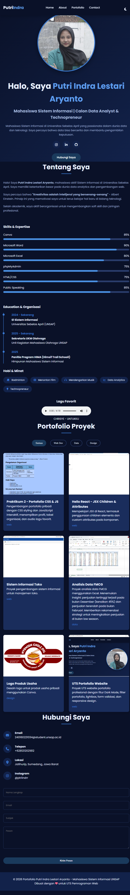

# Portofolio Putri Indra Lestari Aryanto

## Identitas
- Nama: Putri Indra Lestari Aryanto
- NIM: A5.240160221034
- Kelas: SI-IV-B
- Universitas: Universitas Sebelas April (UNSAP)
- Mata Kuliah: Pemrograman Web

## Screenshot Hasil Website

## Fitur Website
- ✅ Dark/Light Mode Toggle
- ✅ Portfolio Gallery dengan Filter JavaScript
- ✅ Lightbox Preview untuk setiap proyek
- ✅ Form Contact dengan Validasi
- ✅ Loading Animation
- ✅ Progress Bar Skills
- ✅ Responsive Design (Mobile, Tablet, Desktop)

## Daftar Proyek dalam Portfolio
| No | Proyek | Kategori |
|----|--------|----------|
| 1 | Praktikum 1 - HTML Dasar | Web |
| 2 | Praktikum 2 - Portofolio CSS & JS | Web |
| 3 | Hello React - JSX | Web |
| 4 | Analisis Data FMCG | Data |
| 5 | Logo Produk Usaha | Design |
| 6 | UTS Portfolio Website | Web |

## Teknologi
- HTML5
- CSS3 (Flexbox, Grid, CSS Variables)
- JavaScript
- Font Awesome
- Google Fonts

## Cara Menjalankan
1. Clone repository ini
2. Buka file `index.html` di browser

## Link GitHub
https://github.com/PutriIndraa/SI-IV-B

## Tanggal Pengerjaan
Mei 2026