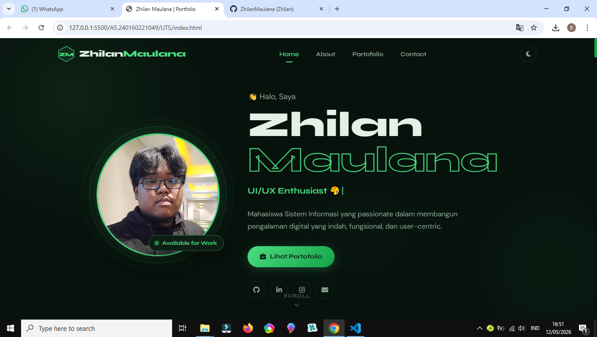
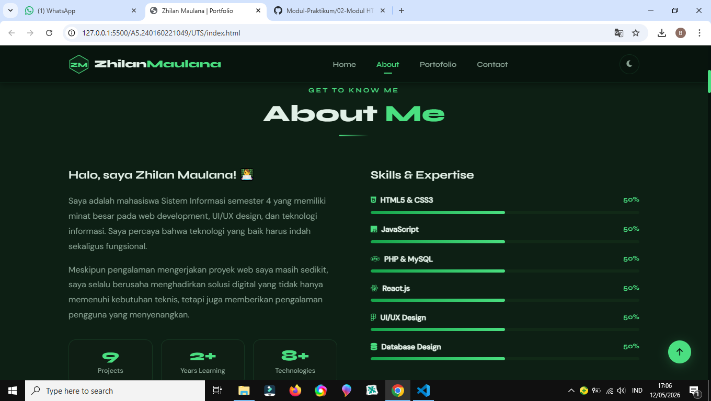
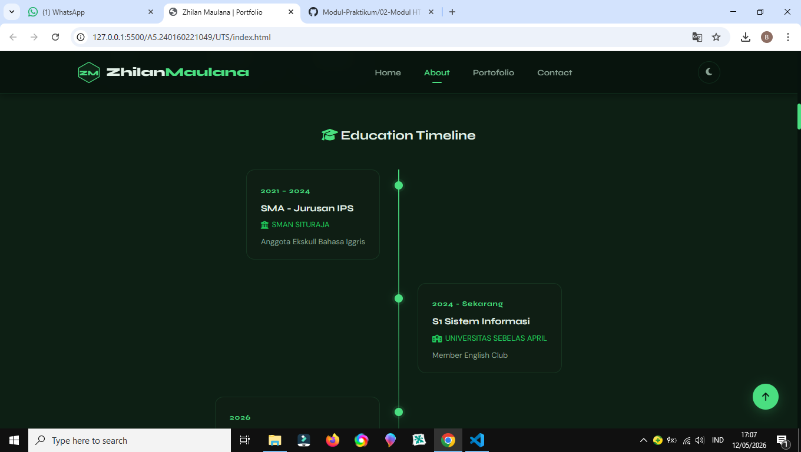
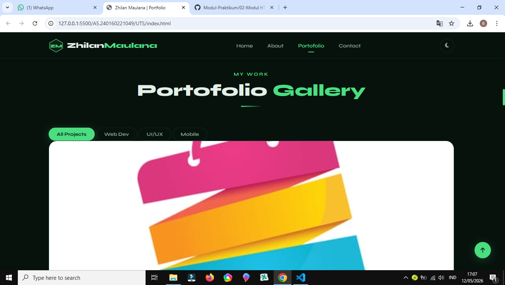
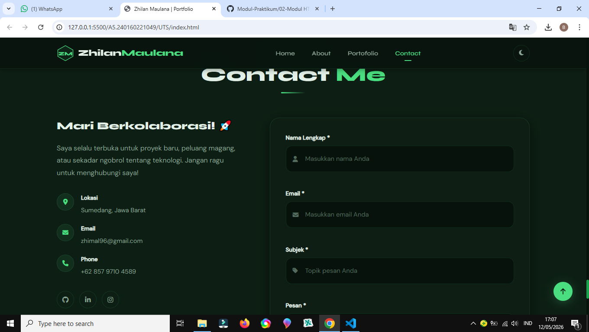

# 🌿 Zhilan Maulana — Portofolio Website

Portofolio profesional mahasiswa Sistem Informasi

## ✨ Fitur Utama

| Fitur | Status |
|-------|--------|
| Header/Navigation responsif | ✅ |
| Logo personal (SVG inline) | ✅ |
| Smooth scrolling | ✅ |
| Hero section dengan animasi CSS | ✅ |
| Foto profil + social media links | ✅ |
| Typewriter effect | ✅ |
| About Me + Progress bar skills | ✅ |
| Education timeline | ✅ |
| Portfolio gallery (6 proyek) | ✅ |
| Lightbox preview | ✅ |
| Filter kategori (JavaScript) | ✅ |
| Dark/Light mode toggle | ✅ |
| Form contact + validasi JS | ✅ |
| Loading animation | ✅ |
| CSS Flexbox/Grid responsive | ✅ |
| Media queries (tablet, mobile) | ✅ |
| Custom animations & transitions | ✅ |
| Lazy loading gambar (Bonus) | ✅ |
| Cursor glow effect (Bonus) | ✅ |

## 📁 Project Structure

```
portofolio/
│
├── index.html                  # Halaman utama
└── assets/
    ├── css/
    │   └── custom.css          # Semua styling custom
    ├── js/
    │   └── script.js           # Semua logika JavaScript
    ├── images/
    │   ├── profile/            # Foto profil
    │   ├── projects/           # Screenshot proyek
    │   └── bg/                 # Background images
    ├── icons/
    │   ├── social/             # Icon sosial media
    │   └── skills/             # Icon skill
    ├── fonts/                  # Font custom (jika ada)
│
└── README.md
```

## 🛠️ Teknologi

- **HTML5** — Semantik, aksesibel
- **CSS3** — Custom Properties, Flexbox, Grid, Animasi
- **JavaScript (Vanilla)** — Tanpa framework
- **Font Awesome 6** — Icon set
- **Google Fonts** — Syne + DM Sans

## 🎨 Design System

### Color Palette (Dark Mode)
| Token | Value | Keterangan |
|-------|-------|------------|
| `--bg` | `#07120d` | Background utama |
| `--accent` | `#4ade80` | Hijau terang (aksen) |
| `--accent-2` | `#22c55e` | Hijau medium |
| `--accent-3` | `#16a34a` | Hijau gelap |
| `--text` | `#e2f0e7` | Teks utama |

### Typography
- **Display / Heading:** Syne (800 weight)
- **Body:** DM Sans (300–500 weight)

## 🚀 Cara Menjalankan

1. Clone atau download project ini
2. Buka `index.html` di browser modern
3. Tidak memerlukan server atau build process

```bash
# Atau gunakan live server
npx serve .
```

## 📱 Responsive Breakpoints

| Breakpoint | Target |
|-----------|--------|
| `> 1024px` | Desktop |
| `768px – 1024px` | Tablet |
| `480px – 768px` | Mobile |
| `< 480px` | Small Mobile |

## 💡 JavaScript Modules

| Modul | Fungsi |
|-------|--------|
| `initLoader()` | Animasi loading halaman |
| `initTheme()` | Dark/light mode + localStorage |
| `initNav()` | Burger menu, scroll effect, active link |
| `initTypewriter()` | Efek ketik otomatis di hero |
| `initScrollReveal()` | Animasi reveal on scroll |
| `initSkillBars()` | Animasi progress bar skills |
| `initPortfolioFilter()` | Filter portfolio berdasarkan kategori |
| `initLightbox()` | Preview proyek full-screen |
| `initContactForm()` | Validasi + simulasi pengiriman form |
| `initBackToTop()` | Tombol kembali ke atas |
| `initLazyLoad()` | Lazy loading gambar (Bonus) |
| `initCursorGlow()` | Efek kursor premium (Bonus) |

## 📸 Screenshot

> Preview screenshot hasil akhir website






## 👤 Author

**Zhilan Maulana** — Mahasiswa Sistem Informasi  
📧 zhimal96@gmail.com  
🔗 [GitHub](https://github.com/ZhilanMaulana) | [LinkedIn](https://www.linkedin.com/in/maulana-zhilan-54364140a?trk=contact-info)

---

> Dibuat untuk UTS Mata Kuliah Pemrograman Berbasis Web Front End